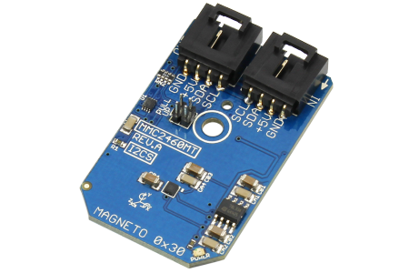

[](https://www.controleverything.com/content/Magnetic-Sensor?sku=MMC2460MT_I2CS)
# MMC2460MT
MMC2460MT 2-Axis Magnetic Sensor 

The MMC2460MT is a 2-axis magnetic sensor with on-chip signal processing.

This Device is available from ControlEverything.com [SKU: MMC2460MT_I2CS]

https://www.controleverything.com/content/Magnetic-Sensor?sku=MMC2460MT_I2CS

This Sample code can be used with Raspberry pi.

##Java 
Download and install pi4j library on Raspberry pi. Steps to install pi4j are provided at:

http://pi4j.com/install.html

Download (or git pull) the code in pi.

Compile the java program.
```cpp
$> pi4j MMC2460MT.java
```

Run the java program as.
```cpp
$> pi4j MMC2460MT
```

##Python 
Download and install smbus library on Raspberry pi. Steps to install smbus are provided at:

https://pypi.python.org/pypi/smbus-cffi/0.5.1

Download (or git pull) the code in pi. Run the program

```cpp
$> python MMC2460MT.py
```

The code output is the raw value of magnetic field in X and Y axis.
